# gameboy-emulator

A simple gameboy emulator written in C++ which uses vulkan for rendering.

## Features
- CPU emulation
- Memory management
- Graphics rendering
- Custom Colors
- Input handling
- Joystick support
- Sound emulation (work in progress)
- ROM loading
- Save states
- Customizable GUI
- Debugging features
  - VRAM viewer
  - Memory viewer
  - Registers

## Platforms
- Windows
- Linux (Not Tested)

## Build

### Prerequisites
- [Premake5](https://premake.github.io/) to generate build files
- [Vulkan SDK](https://vulkan.lunarg.com/)

### Build Instructions 
```sh
git clone https://github.com/Sanjay004mk/gameboy-emulator.git
cd gameboy-emulator
```

Build using visual studio
```sh
premake5 vs2022
```

Build using make
```sh
premake5 make
```

## Controls
### Keyboard
| Key        | Action   |
| ---------- | -------- |
| Arrow Keys | Move     |
| A          | A Button |
| Z          | B Button |
| X          | Start    |
| S          | Select   |
### Joystick
| Button     | Action   |
| ---------- | -------- |
| D-pad      | Move     |
| A / Cross  | A Button |
| B / Circle | B Button |
| Start      | Start    |
| Select     | Select   |

## Roadmap
- [ ] Complete sound emulation
- [ ] Improve debugging tools
- [ ] Improve performance optimizations

## Screenshots

## UI
The UI allows the user to:
- switch between emulation(run) and debugging mode
- set a custom color palette 
- control emulation speed
- load roms 
- save game files 
- use save sates.

In Debug mode, users are presented with an UI that can show the contents of:
- vram
- system memory 
- registers. 
  
Debug mode also has a feature to step through each instruction and view the state of the system.
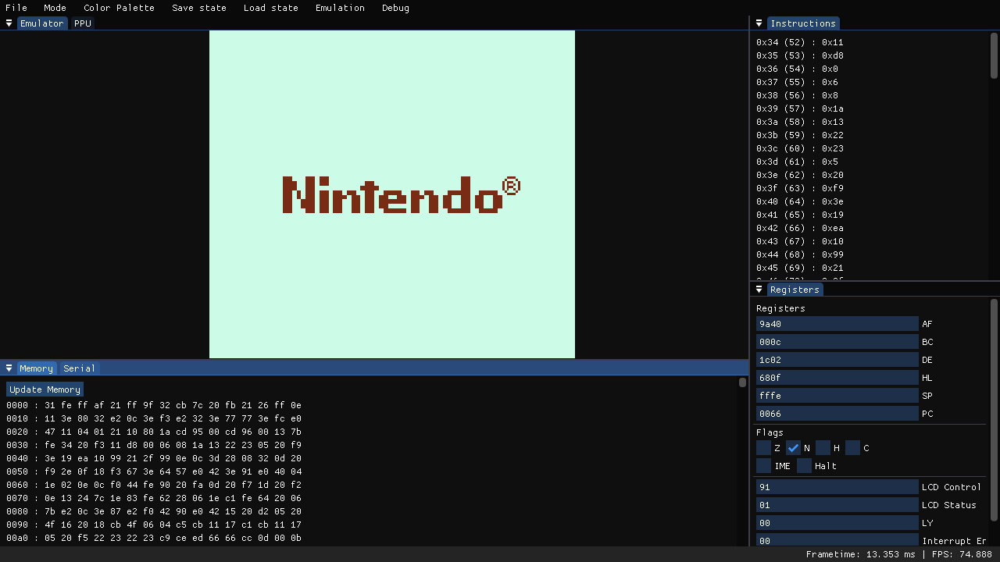
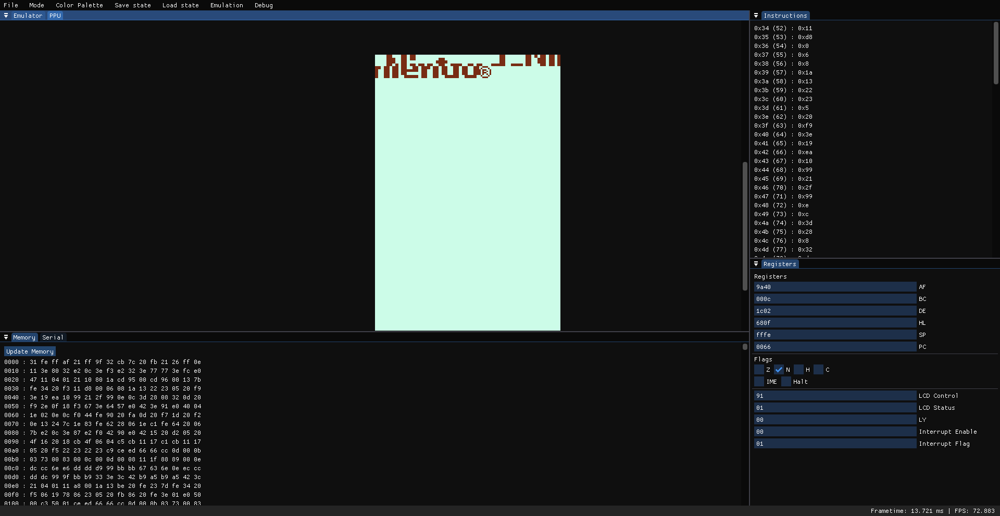
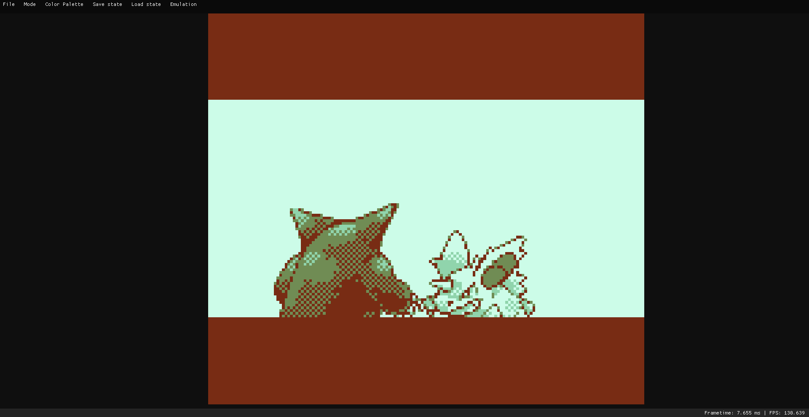
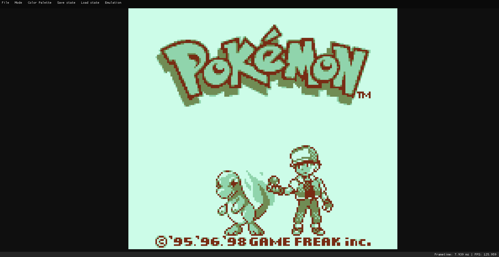

## Games
The emulator has been tested with and has passed all of [blargg's](https://github.com/retrio/gb-test-roms) cpu instructions roms and instruction timing rom.

The following games have been tested and are found to be running properly:
- Dr. Mario
  
  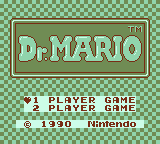
  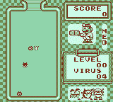
- The Legend of Zelda: Link's Awakeing

    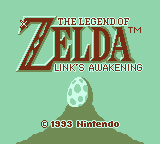
    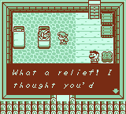
- Pokemon Red
  
    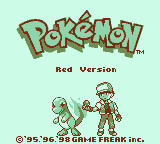
    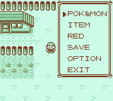
- Tetris
  
    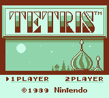
    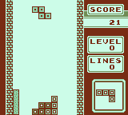